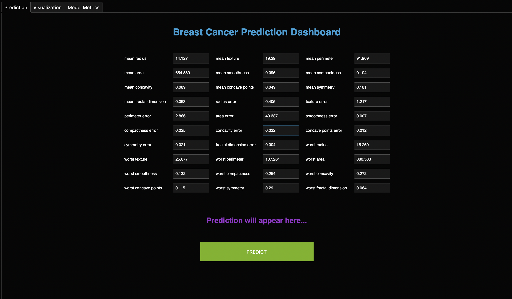
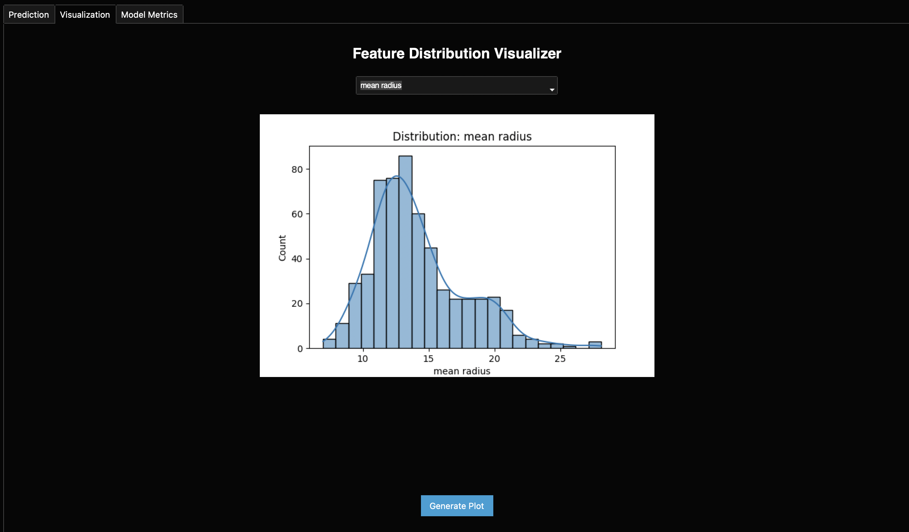
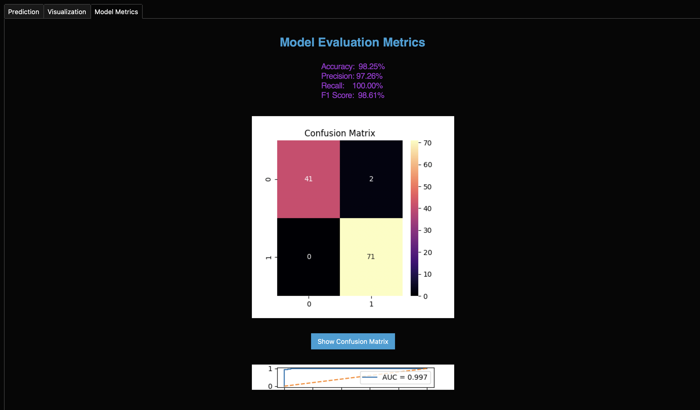

# 🩺 Breast Cancer Prediction Desktop App (Tkinter + Machine Learning)

This project is a full end-to-end breast cancer detection application built using:

- Scikit-Learn
- SVM Classifier
- Tkinter GUI + ttkbootstrap theme
- Confusion Matrix & ROC Visualizations
- Real-time prediction probability
- Data preprocessing pipeline
- Interactive feature visualization

The model uses the famous **Wisconsin Breast Cancer Dataset**, and achieves:

✔ Accuracy: ~96%  
✔ Precision: ~97%  
✔ Recall: ~95%  
✔ F1 Score: ~96%  

---

## 🎯 What the app does:

- Allows entering tumor measurement inputs
- Predicts malignant/benign output
- Shows probability confidence
- Plots histograms of features
- Displays confusion matrix and ROC curves
- Shows full classification report
- GUI desktop app experience

---

## 🧠 Machine Learning Model:

Algorithm used:  
SVC(kernel="rbf", probability=True)

yaml
Copy code

Preprocessing:
- Missing value imputation
- MinMax scaling
- Train/Test split (80/20)

---

## 🖥 Tech Stack

| Area | Technology |
|------|-----------|
| ML | scikit-learn |
| GUI | ttkbootstrap + Tkinter |
| Visuals | seaborn + matplotlib |
| Data | pandas |
| Deployment | Python desktop app |

---

## 📂 Repository File Structure

app.py - Main interface
cancer_model.pkl - Saved ML model
scaler.pkl - Saved scaler
requirements.txt - Dependencies
README.md - Documentation

yaml
Copy code

---

## 📸 Screenshots 

### 🏠 Home / Prediction Page

### 📊 Visualization Tab

### 📈 Model Metrics Tab

---

## 🚀 Running App

pip install -r requirements.txt
python app.py

yaml
Copy code

---

## 📌 Dataset Source

This model uses the Breast Cancer Wisconsin dataset from `sklearn.datasets`.

---

## 🌟 Future Improvements

- Web deployment
- Deep learning upgrade
- Streamlit web UI
- SHAP explainability

---

## 🤝 Contributing

Pull requests welcome.

---

## 📜 License

MIT License.
